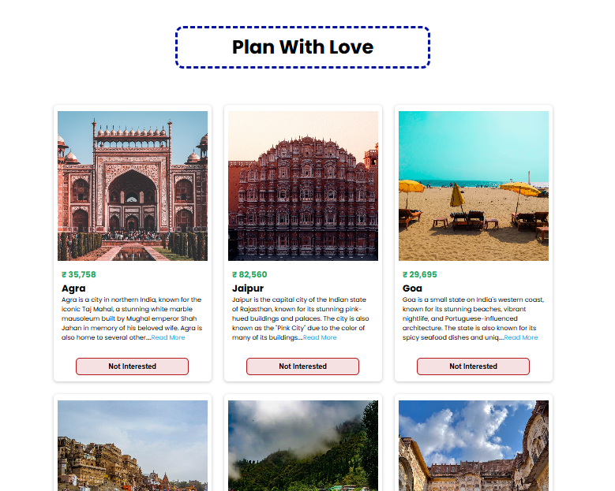

<!DOCTYPE html>
<html>
<head>
</head>
<body>
  <h1>Plan With Love</h1>

  
Welcome to Plan With Love, a React-based web application designed to provide users with a delightful and intuitive interface for exploring tour details. This project serves as a foundational exercise in React development, showcasing basic UI components and navigation.

  <h2>Features</h2>

  <ul>
    <li>User-Friendly Interface: A visually appealing and easy-to-navigate interface for exploring tour information.</li>
    <li>Tour Details: Display key tour details such as destination, dates, itinerary, pricing, and images.</li>
    <li>React Fundamentals: Demonstrates core React concepts including components, state management, and JSX.</li>
  </ul>

  <h2>Technologies Used</h2>

  <ul>
    <li>React: The JavaScript library for building user interfaces.</li>
  </ul>

  <h2>Getting Started</h2>

  <ol>
    <li>Install dependencies:
      <pre><code>npm install</code></pre>
    </li>
    <li>Start the development server:
      <pre><code>npm run start</code></pre>
    </li>
  </ol>
        
  <h2>Screenshot</h2> 
   

</body>
</html>
